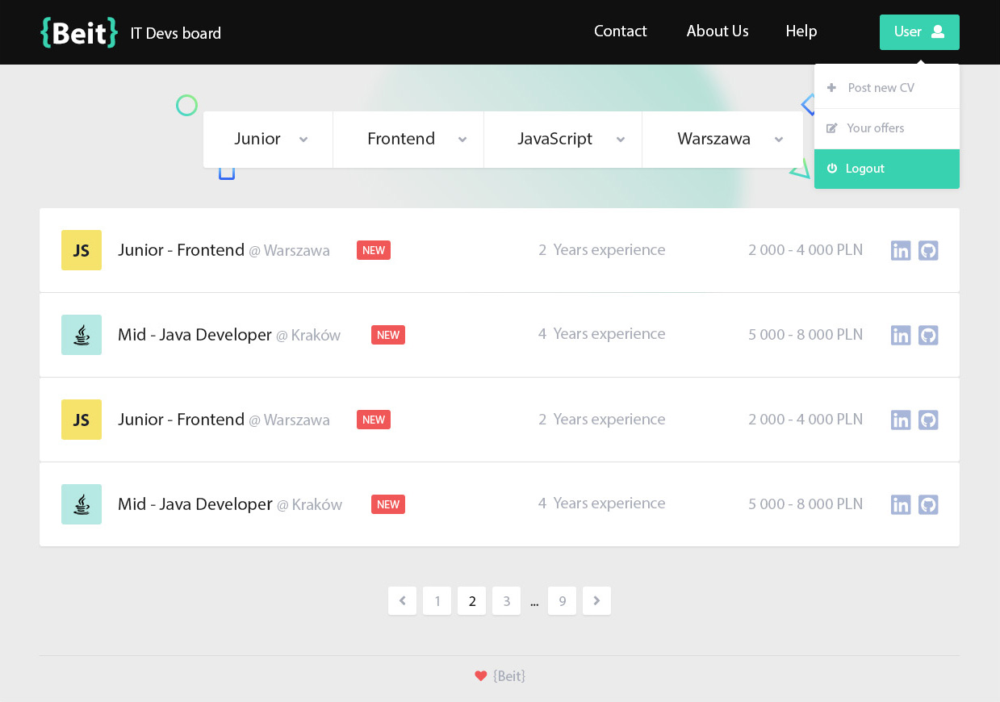

# BeIT

[Demo](https://beit-f0e7e.firebaseapp.com/)

Looking for first job in IT? Just another CRUD React app.

## What I use?
App is build with:
* [React](https://reactjs.org/) - i use Create React App
* [Redux](https://redux.js.org/) - for state management
* [Router](https://github.com/ReactTraining/react-router) - for routing
* [Sass](https://sass-lang.com/) - simply just sass
* [Firebase](https://firebase.google.com/) - for user auth, database and hosting 

## What is all about?
My first app build with React. Users can create account and post or delete their simple one page resume. 

On  the main page visitor can sort resumes by experience level, technology, language or city.

## Installation
You can just clone repository files and run to install all dependencies:

`npm install`

After that just run to start server:

`npm start`

To build project:

`npm run build`

*All project files are located in ./src/*